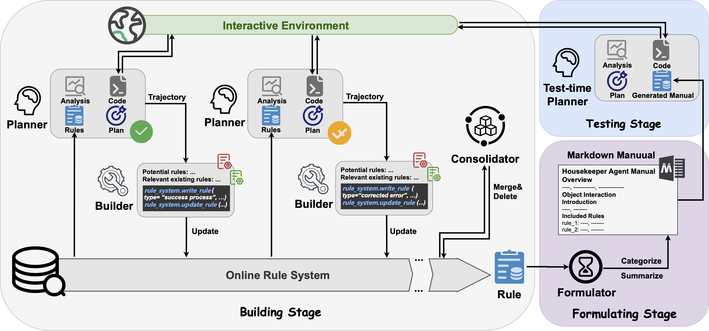

# AutoManual

Source code for [AutoManual: Constructing Instruction Manuals by LLM Agents via Interactive Environmental Learning](https://arxiv.org/abs/2405.16247) (NeurIPS 2024)




## Abstract

Large Language Models (LLM) based agents have shown promise in autonomously completing tasks across various domains, e.g., robotics, games, and web navigation. However, these agents typically require elaborate design and expert prompts to solve tasks in specific domains, which limits their adaptability. We introduce **AutoManual**, a framework enabling LLM agents to autonomously build their understanding through interaction and adapt to new environments. AutoManual categorizes environmental knowledge into diverse rules and optimizes them in an online fashion by two agents: 1) **The Planner** codes actionable plans based on current rules for interacting with the environment. 2) **The Builder** updates the rules through a well-structured rule system that facilitates online rule management and essential detail retention. To mitigate hallucinations in managing rules, we introduce case-conditioned prompting strategy for the Builder. Finally, **the Formulator** agent compiles these rules into a comprehensive manual. The self-generated manual can not only improve the adaptability but also guide the planning of smaller LLMs while being human-readable. Given only one simple demonstration, AutoManual significantly improves task success rates, achieving 97.4% with GPT-4-turbo and 86.2\% with GPT-3.5-turbo on ALFWorld; 98.3\% with GPT-4-turbo and 92.7\% with GPT-3.5-turbo on MiniWoB++; 65.1% with GPT-4-turbo on WebArena (Reddit).


## Setups

We experiment with Python 3.9 for ALFWorld and MiniWoB++, and Python 3.10 for WebArena.

#### ALFWorld

We made some minor changes to the logic of [alfworld](./alfworld) to make it more suitable for code-style plan: remove the article before the object and connect the object and its ID with an underscore.

```bash
# create conda env and install packages
conda create -y --name py39 python=3.9.16
conda activate py39

# install alfworld packages
pip install https://github.com/MarcCote/TextWorld/archive/handcoded_expert_integration.zip
pip install https://github.com/MarcCote/downward/archive/faster_replan.zip
cd automanual/alfworld/
pip install -r requirements.txt
export ALFWORLD_DATA=<root>/automanual/alfworld/downloaded/ # replace <root> with your dir
pip install .
```

#### MiniWoB++

The setup for [MiniWoB++](./automanual_miniwob/computergym) is simple:

```bash
# install requirements
pip install selenium Pillow regex
```

#### WebArena

Follow the instruction [here](https://github.com/minghchen/webarena) to setup the revised WebArena.


## Experiments

Configurate your OpenAI API Key and OpenAI Base URL

```bash
export OPENAI_API_KEY="<your-api-key>" # a valid OpenAI API key starts with sk-
export OPENAI_BASE_URL="<your-base-url>" # e.g., https://api.openai.com/v1
```

The manuals we built are already included in each environment directory for testing. You can also build it as follows.

**ALFWorld:**

```bash
cd automanual/automanual_alfworld

# Building stage
python main_build.py --agent_type "autobuild_case" --run_name "autobuildcase_logs" \
			--model_name "gpt-4-1106-preview" --assistant_api --num_env_per_task 6

# Formulating stage
python main_test.py --agent_type "autobuild_case" --run_name "autobuildcase_logs" \
			--model_name "gpt-4-1106-preview" --assistant_api --mode "formulating" --is_resume

# Testing stage, 'model_name' can be replace with gpt-3.5-turbo
python main_test.py --agent_type "autobuild_case" --run_name "autobuildcase_logs" \
			--model_name "gpt-4-1106-preview" --assistant_api --mode "testing" \
			--num_env_per_task 25 --is_resume
```

`--agent_type` can be selected from "replan", "autobuild_case", "autobuild_offline".

If the building or testing process stops in the middle, you can add `--is_resume --start_env_id <stop_env_id>` to continue.

**MiniWoB++:**

```bash
cd automanual/automanual_miniwob

# Building stage
python main_build.py --agent_type "autobuild_case" --run_name "autobuildcase_logs" \
			--model_name "gpt-4-1106-preview" --assistant_api --num_env_per_task 6

# Formulating stage
python main_test.py --agent_type "autobuild_case" --run_name "autobuildcase_logs" \
			--model_name "gpt-4-1106-preview" --assistant_api --mode "formulating" --is_resume

# Testing stage
python main_test.py --agent_type "autobuild_case" --run_name "autobuildcase_logs" \
			--model_name "gpt-4-1106-preview" --assistant_api --mode "testing" \
			--num_env_per_task 6 --is_resume
```

optionally add `--headless` 

**WebArena:**

We divide tasks in reddit into two splits. You can select the split by setting `--split` 1 or 2.

You can select the website, including `["reddit", "shopping_admin", "shopping", "map", "gitlab"]`, by setting `--examine_sites`.

```bash
cd automanual/automanual_webarena

# Building stage
python main_build.py --agent_type "autobuild_case" --run_name "autobuild_reddit_1_logs" \
			--model_name "gpt-4-1106-preview" --examine_sites "reddit" \
			--split 1 --num_env_per_task 7

# Formulating stage
python main_test.py --agent_type "autobuild_case" --run_name "autobuild_reddit_1_logs" \
			--model_name "gpt-4-1106-preview" --mode "formulating" --examine_sites "reddit" \
			--split 1 --num_env_per_task 7 --is_resume

# Testing stage
python main_test.py --agent_type "autobuild_case" --run_name "autobuild_reddit_1_logs" \
			--model_name "gpt-4-1106-preview" --mode "testing" --examine_sites "reddit" \
			--split 1 --num_env_per_task 7 --is_resume
```

We provide traces of the test results, which achieved a success rate of 65.1% in the paper, available [here](https://drive.google.com/drive/folders/11YMFWIM4qyeINVdH54FBF_3LRtq5ExZB?hl=zh-cn).


## Citation

```
@misc{chen2024automanual,
      title={AutoManual: Constructing Instruction Manuals by LLM Agents via Interactive Environmental Learning}, 
      author={Minghao Chen and Yihang Li and Yanting Yang and Shiyu Yu and Binbin Lin and Xiaofei He},
      year={2024},
      eprint={2405.16247},
      archivePrefix={arXiv},
      primaryClass={cs.AI}
}
```
